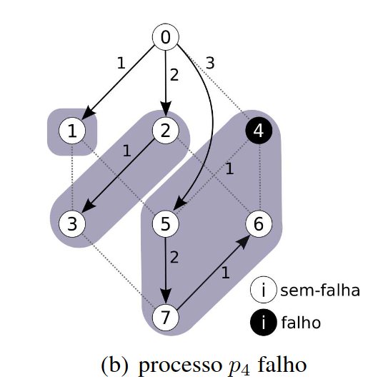

# Trabalho Prático 2: Árvore Geradora Mínima Autonômica com o vCube
## Autor: Rubens Zandomenighi Laszlo GRR20206147

## Motivação trabalho
- A árvore que conecta todos os nodos da rede/sistema com o menor custo.



## Implementação 
### Funções implementadas: 
- ```printSpanningAutonomicTree ``` : Função responsável por imprimir a árvore geradora mínima autonômica, sendo chamada conforme evento 
### Pré requisitos criados para execução da função
- Criado novo evento referente a impressão da árvore, dessa forma me permitiu durante os testes do trabalho, refinar a função conforme os testes executados. No caso dos logs finais do programa, conforme solicitado pelo professor Elias, estou adicionando o evento de impressão da árvore 1x, sendo ao final do programa.

## Casos de teste
1. **Raiz: 0; Dimensões do vCube: 2; nenhum processo falho;**


2. **Raiz: 0; Dimensões do vCube: 3; nenhum processo falho;**
- Testes para geração da árvore geradora 


3. **Raiz: 0; Dimensões do vCube: 3; Lista de processos falhos: 1, 2, 4, 7;**


4. **Raiz: 7; Dimensões do vCube: 3; Lista de processos falhos: 0;**


5. **Raiz: 0; Dimensões do vCube: 4; nenhum processo falho.**


## Código Fonte
Disponível em: 

## Logs: 
Disponíveis em:
1. Link Caso 1 
2. Link Caso 2
3. Link Caso 3
4. Link Caso 4
5. Link Caso 5


